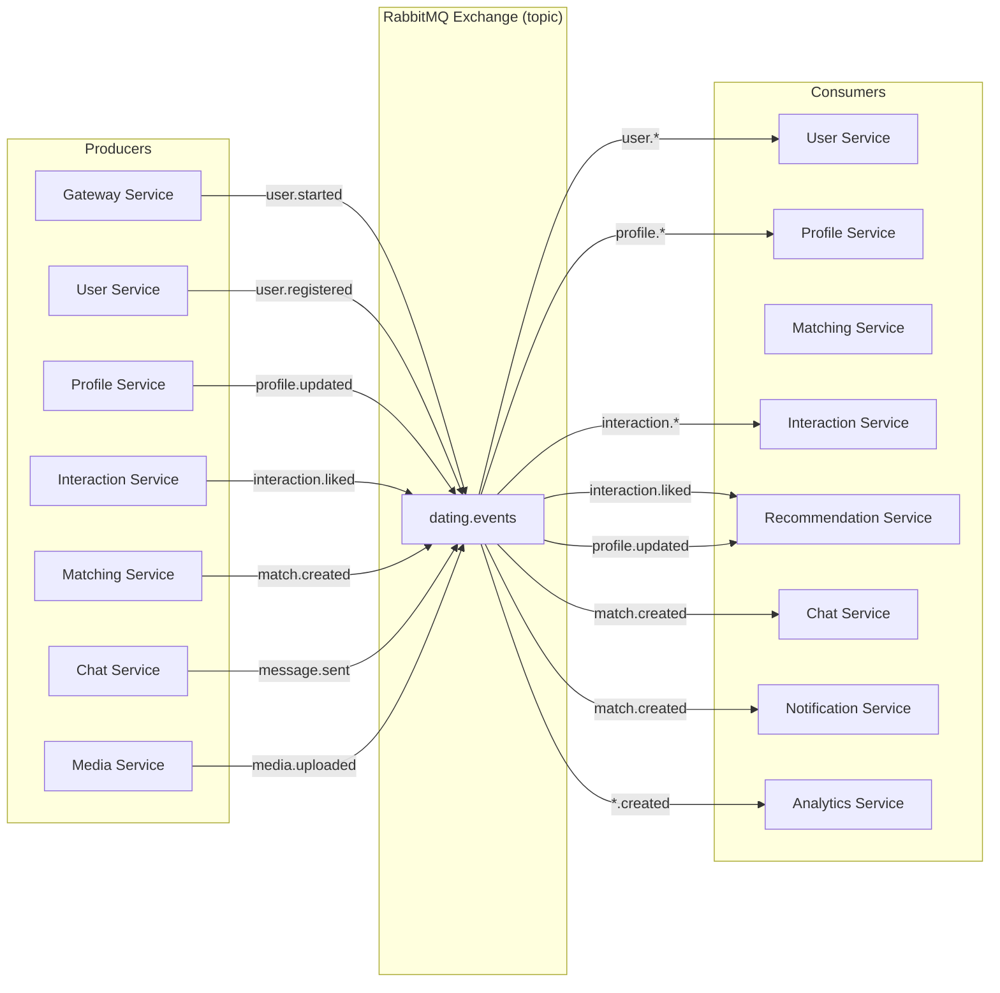
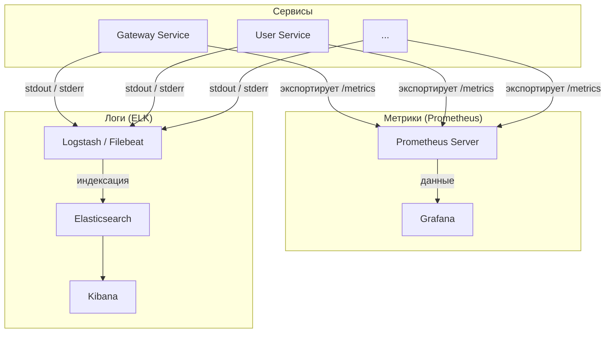
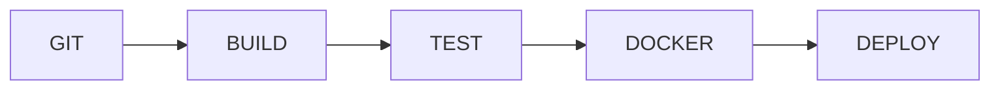

# Dating Telegram Bot — Архитектура (DDD + Microservices)

## 1. Общий обзор

Цель: разработка Telegram dating-бота с использованием **DDD (Domain-Driven Design)** и **микросервисной архитектуры**.

**Telegram-интеграция реализована на Python (Aiogram)**, все бизнес-сервисы написаны на **Go** для высокой производительности и эффективной работы с конкурентными запросами.

Система ориентирована на:

- масштабируемость
- отказоустойчивость
- расширяемость
- соответствие требованиям оценивания

---

## 2. Технологический стек

### Core

- **Go** — бизнес-сервисы (User, Profile, Matching, Interaction, Recommendation, Chat, Media, Notification, Analytics)
- **Python 3.11+** — Gateway Service (взаимодействие с Telegram Bot API)
- **Aiogram** — библиотека для работы с Telegram Bot API

### Infrastructure

- PostgreSQL (основная БД)
- Redis (кэш + очереди)
- RabbitMQ (event-driven)
- MinIO (S3 хранилище)

### DevOps

- Docker + Docker Compose
- GitHub Actions (CI/CD)
- Prometheus + Grafana (метрики)
- ELK Stack (логирование)

---

## 3. Архитектура системы

```mermaid
graph TD
    A[Telegram User] -->|Commands/Updates| B(Gateway Service — Python/Aiogram)

    B -->|gRPC/HTTP| C[User Service — Go]
    B -->|gRPC/HTTP| D[Profile Service — Go]
    B -->|gRPC/HTTP| E[Matching Service — Go]
    B -->|gRPC/HTTP| F[Interaction Service — Go]
    B -->|gRPC/HTTP| G[Recommendation Service — Go]
    B -->|gRPC/HTTP| H[Chat Service — Go]
    B -->|gRPC/HTTP| I[Media Service — Go]
    B -->|gRPC/HTTP| J[Notification Service — Go]

    subgraph "Message Broker (RabbitMQ)"
        K[Events Exchange]
    end

    B -.->|Async Events| K
    C -.->|Async Events| K
    D -.->|Async Events| K
    E -.->|Async Events| K
    F -.->|Async Events| K
    G -.->|Async Events| K
    H -.->|Async Events| K
    I -.->|Async Events| K
    J -.->|Async Events| K

    subgraph "Databases"
        C -->|PostgreSQL| L[(User DB)]
        D -->|PostgreSQL| M[(Profile DB)]
        E -->|PostgreSQL| N[(Matching DB)]
        F -->|PostgreSQL| O[(Interaction DB)]
        G -->|PostgreSQL| P[(Rating DB)]
        H -->|PostgreSQL| Q[(Chat DB)]
        I -->|Minio S3| R[(Media Storage)]
        I -->|PostgreSQL| S[(Media Metadata DB)]
        J -->|PostgreSQL| T[(Notifications DB)]
    end

    subgraph "Cache"
        G -->|Redis| U[Cached Rankings]
    end

    subgraph "Monitoring"
        X[Prometheus] -->|Metrics|
        Z[ELK Stack] -->|Logs| AA[Kibana]
    end

    %% Взаимодействие сервисов с мониторингом
    B -->|metrics / logs| X
    B -->|metrics / logs| Z
    C -->|metrics / logs| X
    C -->|metrics / logs| Z
    D -->|metrics / logs| X
    D -->|metrics / logs| Z
    E -->|metrics / logs| X
    E -->|metrics / logs| Z
    F -->|metrics / logs| X
    F -->|metrics / logs| Z
    G -->|metrics / logs| X
    G -->|metrics / logs| Z
    H -->|metrics / logs| X
    H -->|metrics / logs| Z
    I -->|metrics / logs| X
    I -->|metrics / logs| Z
    J -->|metrics / logs| X
    J -->|metrics / logs| Z

    %% Analytics Service получает события из RabbitMQ и отправляет агрегированные метрики в мониторинг
    K -->|events| AB[Analytics Service — Go]
    AB -->|aggregated metrics| X
    AB -->|aggregated logs| Z
```

### 3.1 Описание компонентов

1. **Gateway Service (Python/Aiogram): единственная точка взаимодействия с Telegram Bot API. Принимает обновления от пользователей, преобразует их в запросы к внутренним сервисам и возвращает ответы.**
2. **User Service (Go): управление профилями пользователей, регистрация, редактирование анкеты.**
3. **Profile Service (Go): анкеты пользователей — возраст, пол, интересы, город, полнота заполнения, связь с фотографиями.**
4. **Matching Service (Go): логика мэтчинга — проверка взаимных лайков, создание мэтчей, хранение истории мэтчей.**
5. **Interaction Service (Go): обработка лайков/дизлайков, запись действий, подсчёт статистики взаимодействий.**
6. **Recommendation Service (Go): ранжирование анкет — расчёт первичного, поведенческого и комбинированного рейтингов, выдача следующей анкеты, кэширование в Redis.**
7. **Chat Service (Go): обмен сообщениями между пользователями после мэтча, хранение сообщений.**
8. **Media Service (Go): загрузка, хранение и обработка фотографий в S3-совместимом хранилище (MinIO), генерация URL.**
9. **Notification Service (Go): отправка уведомлений о мэтчах, новых сообщениях и т.п. через Gateway Service.**
10. **Analytics Service (Go): сбор метрик, логирование, формирование отчётов, мониторинг производительности.**
11. **Message Broker (RabbitMQ): асинхронная передача событий между сервисами.**
12. **Redis: кэширование ранжированных списков анкет, хранение временных данных (например, сессии).**
13. **Метрики и логирование: Prometheus + Grafana для сбора метрик, ELK для централизованного логирования.**

---

## 4. Описание сервисов

| Сервис                     | Ответственность                                                                                                                   | Технологии                          |
| -------------------------- | --------------------------------------------------------------------------------------------------------------------------------- | ----------------------------------- |
| **Gateway Service**        | Точка входа для Telegram Bot, обработка команд, взаимодействие с Telegram API, маршрутизация запросов к внутренним сервисам.      | Python, Aiogram, aiohttp            |
| **User Service**           | Управление пользователями: регистрация, Telegram ID, username, реферальная система, авторизация.                                  | Go, PostgreSQL                      |
| **Profile Service**        | Анкеты пользователей: возраст, пол, интересы, город, полнота заполнения, связь с фотографиями.                                    | Go, PostgreSQL                      |
| **Matching Service**       | Логика мэтчинга: проверка взаимных лайков, создание мэтчей, хранение истории мэтчей.                                              | Go, PostgreSQL, RabbitMQ            |
| **Interaction Service**    | Обработка лайков и дизлайков: запись действий, подсчёт статистики взаимодействий.                                                 | Go, PostgreSQL                      |
| **Recommendation Service** | Ранжирование анкет: расчёт первичного, поведенческого и комбинированного рейтингов, выдача следующей анкеты, кэширование в Redis. | Go, PostgreSQL, Redis               |
| **Chat Service**           | Обмен сообщениями между пользователями после мэтча, хранение сообщений.                                                           | Go, PostgreSQL, WebSockets          |
| **Media Service**          | Загрузка, хранение и обработка фотографий в S3-совместимом хранилище (MinIO), генерация URL.                                      | Go, MinIO, PostgreSQL               |
| **Notification Service**   | Отправка уведомлений пользователям (о мэтчах, сообщениях) через Gateway Service.                                                  | Go, PostgreSQL, RabbitMQ            |
| **Analytics Service**      | Сбор метрик, логирование, формирование отчётов, мониторинг производительности.                                                    | Go, Prometheus, Grafana, ELK        |

## 5. Схемы данных

### Каждый сервис использует свою базу данных PostgreSQL. Ниже приведены SQL-скрипты для создания необходимых таблиц.

### 5.1 User Service

```sql
-- База данных: user_db
CREATE TABLE users (
    id BIGSERIAL PRIMARY KEY,
    telegram_id BIGINT NOT NULL UNIQUE,
    username VARCHAR(255),
    first_name VARCHAR(255),
    last_name VARCHAR(255),
    registered_at TIMESTAMP DEFAULT CURRENT_TIMESTAMP,
    last_active TIMESTAMP DEFAULT CURRENT_TIMESTAMP,
    referral_by BIGINT REFERENCES users(id) ON DELETE SET NULL
);

CREATE INDEX idx_users_telegram_id ON users(telegram_id);
```

### 5.2 Profile Service

```sql
-- База данных: profile_db
CREATE TABLE profiles (
    id BIGSERIAL PRIMARY KEY,
    user_id BIGINT NOT NULL UNIQUE,
    age INT CHECK (age >= 18 AND age <= 100),
    gender VARCHAR(10) CHECK (gender IN ('male', 'female', 'other')),
    city VARCHAR(255),
    interests TEXT[],
    photos_count INT DEFAULT 0,
    fullness_percent FLOAT DEFAULT 0,
    updated_at TIMESTAMP DEFAULT CURRENT_TIMESTAMP
);

CREATE INDEX idx_profiles_user_id ON profiles(user_id);
CREATE INDEX idx_profiles_gender_city ON profiles(gender, city);
```

### 5.3 Matching Service

```sql
-- База данных: matching_db
CREATE TABLE matches (
    id BIGSERIAL PRIMARY KEY,
    user1_id BIGINT NOT NULL,
    user2_id BIGINT NOT NULL,
    created_at TIMESTAMP DEFAULT CURRENT_TIMESTAMP,
    status VARCHAR(20) DEFAULT 'active',
    conversation_started BOOLEAN DEFAULT FALSE,
    CONSTRAINT unique_match UNIQUE (user1_id, user2_id)
);

CREATE INDEX idx_matches_user1_id ON matches(user1_id);
CREATE INDEX idx_matches_user2_id ON matches(user2_id);
CREATE INDEX idx_matches_created_at ON matches(created_at);
```

### 5.4 Interaction Service

```sql
-- База данных: interaction_db
CREATE TABLE interactions (
    id BIGSERIAL PRIMARY KEY,
    from_user_id BIGINT NOT NULL,
    to_user_id BIGINT NOT NULL,
    type VARCHAR(10) NOT NULL CHECK (type IN ('like', 'pass')),
    created_at TIMESTAMP DEFAULT CURRENT_TIMESTAMP,
    time_of_day INT NOT NULL  -- час дня (0-23)
);

CREATE TABLE user_stats (
    user_id BIGINT PRIMARY KEY,
    likes_received INT DEFAULT 0,
    likes_given INT DEFAULT 0,
    passes_given INT DEFAULT 0,
    matches_count INT DEFAULT 0,
    like_pass_ratio FLOAT DEFAULT 0,
    updated_at TIMESTAMP DEFAULT CURRENT_TIMESTAMP
);

CREATE INDEX idx_interactions_from_user ON interactions(from_user_id);
CREATE INDEX idx_interactions_to_user ON interactions(to_user_id);
CREATE INDEX idx_interactions_created_at ON interactions(created_at);
```

### 5.5 Recommendation Service

```sql
-- База данных: rating_db
CREATE TABLE ratings (
    user_id BIGINT PRIMARY KEY,
    primary_rating FLOAT DEFAULT 0,
    behavioral_rating FLOAT DEFAULT 0,
    combined_rating FLOAT DEFAULT 0,
    calculated_at TIMESTAMP DEFAULT CURRENT_TIMESTAMP
);

CREATE TABLE rating_log (
    id BIGSERIAL PRIMARY KEY,
    user_id BIGINT NOT NULL REFERENCES ratings(user_id) ON DELETE CASCADE,
    old_combined FLOAT,
    new_combined FLOAT,
    changed_at TIMESTAMP DEFAULT CURRENT_TIMESTAMP,
    reason TEXT
);

CREATE INDEX idx_rating_log_user_id ON rating_log(user_id);
CREATE INDEX idx_ratings_combined ON ratings(combined_rating DESC);
```

### 5.6 Chat Service

```sql
-- База данных: chat_db
CREATE TABLE conversations (
    id BIGSERIAL PRIMARY KEY,
    match_id BIGINT NOT NULL UNIQUE,
    created_at TIMESTAMP DEFAULT CURRENT_TIMESTAMP,
    last_message_at TIMESTAMP DEFAULT CURRENT_TIMESTAMP
);

CREATE TABLE messages (
    id BIGSERIAL PRIMARY KEY,
    conversation_id BIGINT NOT NULL REFERENCES conversations(id) ON DELETE CASCADE,
    sender_id BIGINT NOT NULL,
    receiver_id BIGINT NOT NULL,
    content TEXT NOT NULL,
    sent_at TIMESTAMP DEFAULT CURRENT_TIMESTAMP,
    is_read BOOLEAN DEFAULT FALSE
);

CREATE INDEX idx_messages_conversation ON messages(conversation_id);
CREATE INDEX idx_messages_sender ON messages(sender_id);
CREATE INDEX idx_messages_receiver ON messages(receiver_id);
CREATE INDEX idx_messages_sent_at ON messages(sent_at);
```

### 5.7 Media Service

```sql
-- База данных: media_db
CREATE TABLE media (
    id BIGSERIAL PRIMARY KEY,
    user_id BIGINT NOT NULL,
    s3_key VARCHAR(512) NOT NULL UNIQUE,
    original_filename VARCHAR(255),
    mime_type VARCHAR(100),
    file_size INT,
    uploaded_at TIMESTAMP DEFAULT CURRENT_TIMESTAMP,
    is_main BOOLEAN DEFAULT FALSE
);

CREATE INDEX idx_media_user_id ON media(user_id);
CREATE INDEX idx_media_s3_key ON media(s3_key);
```

### 5.8 Notification Service

```sql
-- База данных: notification_db
CREATE TABLE notifications (
    id BIGSERIAL PRIMARY KEY,
    user_id BIGINT NOT NULL,
    message TEXT NOT NULL,
    sent BOOLEAN DEFAULT FALSE,
    created_at TIMESTAMP DEFAULT CURRENT_TIMESTAMP,
    sent_at TIMESTAMP
);

CREATE INDEX idx_notifications_user_id ON notifications(user_id);
CREATE INDEX idx_notifications_sent ON notifications(sent);
```

## 6. Взаимодействие между сервисами

### Все сервисы публикуют и подписываются на события через единый брокер.

**События и подписчики**:

| Событие             | Публикует           | Подписчики                                            | Описание                                               |
| ------------------- | ------------------- | ----------------------------------------------------- | ------------------------------------------------------ |
| `user.registered`   | User Service        | Notification Service, Analytics Service               | Отправить приветствие, записать метрику                |
| `profile.updated`   | Profile Service     | Recommendation Service                                | Пересчитать первичный рейтинг                          |
| `interaction.liked` | Interaction Service | Recommendation Service, Matching Service              | Обновить поведенческий рейтинг, проверить мэтч         |
| `match.created`     | Matching Service    | Notification Service, Chat Service, Analytics Service | Уведомить пользователей, создать чат, записать метрику |
| `media.uploaded`    | Media Service       | Profile Service                                       | Обновить photos_count в профиле                        |
| `message.sent`      | Chat Service        | Notification Service, Analytics Service               | Отправить уведомление о сообщении, записать метрику    |

### **Схема обмена сообщениями:**



## 7. Алгоритмы ранжирования

### Реализуются в Recommendation Service (Go).

#### Уровень 1: Первичный рейтинг

- **Возраст, пол, интересы, гео: скоринг на основе близости предпочтений пользователя.**
- **Полнота анкеты: от 0 до 1 в зависимости от заполненных полей и количества фото.**
- **Первичные предпочтения: бонус за соответствие заданным критериям (возрастной диапазон, пол, город).**

**Формула:**

```text
primary_rating = (preferences_match_score * 0.6) + (fullness_score * 0.4)
```

#### Уровень 2: Поведенческий рейтинг

- **Количество полученных лайков.**
- **Соотношение лайков и пропусков.**
- **Частота мэтчей.**
- **Инициирование диалогов после мэтча (из Chat Service).**
- **Временные параметры активности.**

**Формула (обновляется по событиям):**

```text
behavioral_rating = (likes_received_weight * norm_likes) + (like_pass_ratio * 0.3) + (matches_weight * norm_matches)
```

#### Уровень 3: Комбинированный рейтинг

- **Весовая интеграция первичного и поведенческого рейтингов.**
- **Реферальная система: бонус за приглашённых друзей.**

```text
combined_rating = 0.3 * primary_rating + 0.7 * behavioral_rating
```

**Рейтинги пересчитываются периодически через фоновые задачи (Go workers) и по событиям.**

## 8. Взаимодействие с мониторингом



## 9. CI/CD Pipeline



## 10. Дополнительные технологии

| Технология | Применение | Обоснование |
|------------|------------|-------------|
| Redis | Кэширование предварительно отранжированных списков анкет в Recommendation Service (пачки по 10 анкет). | Ускоряет выдачу следующей анкеты, снижает нагрузку на БД. |
| Go Workers | Периодический пересчёт рейтингов, очистка старых логов, асинхронная обработка изображений. | Встроенные возможности Go (goroutines, tickers) заменяют Celery. |
| RabbitMQ | Передача всех событий между сервисами (лайки, мэтчи, регистрации). | Обеспечивает слабую связность, надёжность и масштабируемость. |
| Метрики и логирование | Prometheus + Grafana для метрик, ELK для логов. Analytics Service собирает и агрегирует данные. | Необходимо для мониторинга, отладки и аудита. |
| S3 (MinIO) | Хранение фотографий в MinIO через Media Service. | Масштабируемое хранилище, разгрузка серверов. |
| CI/CD (GitHub Actions) | Автоматические проверки, сборка, деплой при пуше в основную ветку. | Обеспечивает качество и скорость доставки. |
| Docker / Docker Compose | Контейнеризация всех сервисов, локальная оркестрация. | Упрощает развёртывание и тестирование. |
| Нагрузочное тестирование JMeter | Проверка производительности ключевых эндпоинтов. | Гарантирует стабильность под нагрузкой. |
| WebSocket в Chat Service | Реальное время доставки сообщений. | Улучшает пользовательский опыт. |
| Асинхронная обработка изображений | Сжатие и ресайз фото через Go workers. | Ускоряет ответ на загрузку. |
